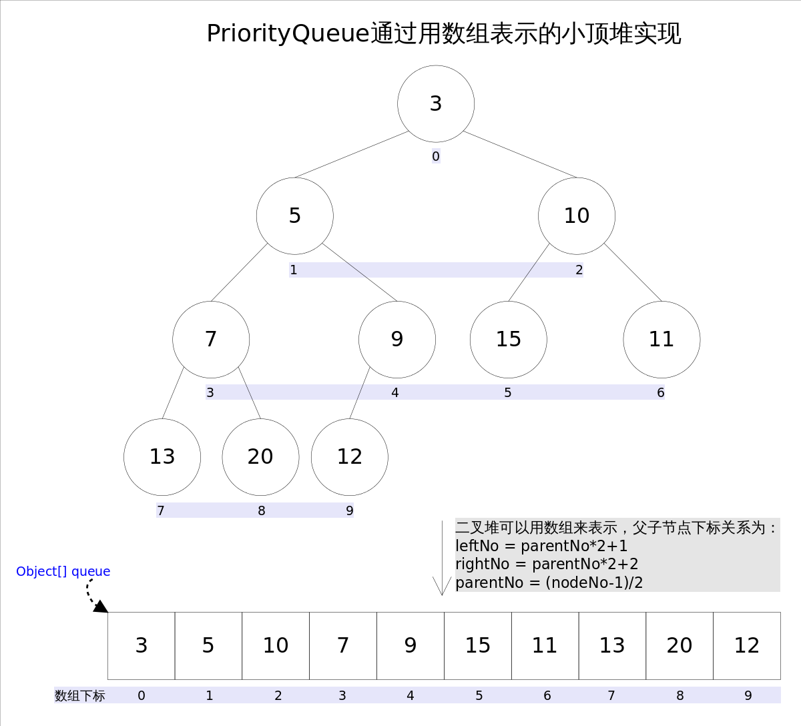

学习笔记

## Queue
Queue继承了Collection,在此基础上增加了插入、提取、检查操作，每种方法以两种形式呈现：一种是炒作失败发生异常，一种是
返回特殊值（null或者false），插入操作的后一种形式是为限制容量的queue实现而设计的。

|   | 引发异常 |返回特殊值 |
| ------------- | ------------- |------------- |
| 插入 | add(e)  |offer(e)  |
| 删除 | remove()  |poll()  |
| 检查 | element()  |peek()  |
  
队列通常以FIFO的方式进行排序(priorityqueue和stack除外)，当插入操作时是操作队尾，remove获得poll都是操作的队头。

### PriorityQueue
PriorityQueue是用堆实现的优先级队列，可以通过设置Comparator进行数据的排序处理。它不允许null元素，默认情况下
head元素为最小元素，poll、remove、peek和element操作都是基于head的操作。

它是非线程安全的，当多线程操作时，可以使用PriorityBlockingQueue类进行安全操作。

插入数据逻辑如下：

    public boolean offer(E e) {
          if (e == null)
              throw new NullPointerException();
          modCount++;
          int i = size;
          if (i >= queue.length)
              grow(i + 1);
          size = i + 1;
          if (i == 0)
              queue[0] = e;
          else
              siftUp(i, e);
          return true;
    }
    
    private void siftUp(int k, E x) {
        if (comparator != null)
            siftUpUsingComparator(k, x); 
        else
            siftUpComparable(k, x); //
    }

    private void siftUpComparable(int k, E x) {
        Comparable<? super E> key = (Comparable<? super E>) x;
        while (k > 0) {
            int parent = (k - 1) >>> 1; //查找父节点
            Object e = queue[parent];
            if (key.compareTo((E) e) >= 0) //比较插入数据和父节点,选择是否继续向上替换
                break;
            queue[k] = e;
            k = parent;
        }
        queue[k] = key;
    }
    
  
    
获取数据如下：

    public E poll() {
        if (size == 0)
            return null;
        int s = --size;
        modCount++;
        E result = (E) queue[0];  //result为head节点
        E x = (E) queue[s];       //获得tail元素
        queue[s] = null;
        if (s != 0)
            siftDown(0, x);       //将tail元素代替head的元素,开始从头向下替换
        return result;
    }
    
    private void siftDown(int k, E x) {
        if (comparator != null)
            siftDownUsingComparator(k, x);
        else
            siftDownComparable(k, x);
    }

    private void siftDownComparable(int k, E x) {
        Comparable<? super E> key = (Comparable<? super E>)x;
        int half = size >>> 1;        // 数组的从中间划分,右边都是叶子节点
        while (k < half) {
            int child = (k << 1) + 1; // 获取到左节点
            Object c = queue[child];
            int right = child + 1;    //获取到右节点
            if (right < size &&
                ((Comparable<? super E>) c).compareTo((E) queue[right]) > 0)
                c = queue[child = right];     //left和right比较,小的就选择right继续比较
            if (key.compareTo((E) c) <= 0)    //如果key小于left和right,就不用替换了
                break;
            queue[k] = c;                     //否则left和right小的那个就是最新的父节点
            k = child;                        //eft和right小的那个index(chlid)就是下一轮比较的父节点
        }
        queue[k] = key;
    }
    
    

    
    
图示来源：
https://www.cnblogs.com/CarpenterLee/p/5488070.html